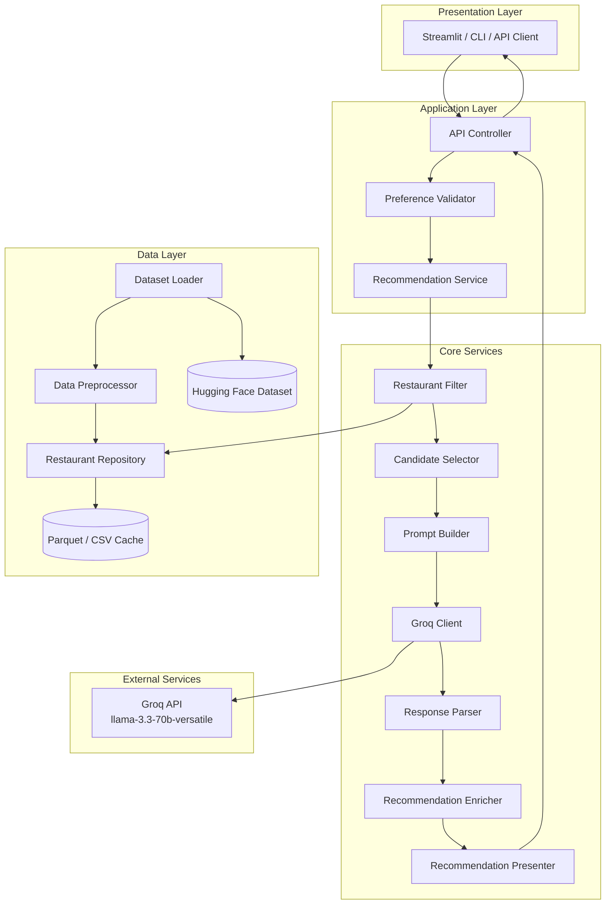
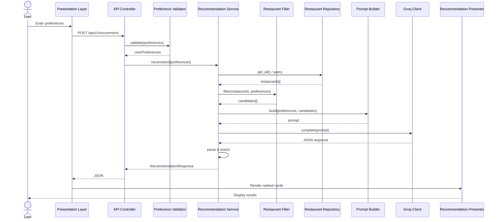
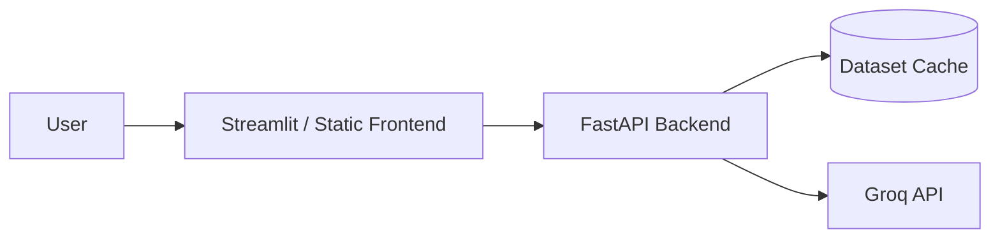

# Architecture — AI-Powered Restaurant Recommendation System

This document describes the technical architecture for the Zomato-inspired restaurant recommendation service defined in [context.md](./context.md). The system combines **structured restaurant data from Hugging Face** with **Groq** to produce personalized, explainable recommendations.

> **LLM Provider:** This project uses **[Groq](https://groq.com/)** as its sole LLM provider. All ranking, summarization, and explanation tasks are handled via the Groq API using the official `groq` Python SDK. No other LLM providers (OpenAI, Anthropic, Gemini, local models, etc.) are used.

| Setting | Value |
|---------|-------|
| Provider | Groq |
| Primary model | `llama-3.3-70b-versatile` |
| Fallback model (dev) | `llama-3.1-8b-instant` |
| SDK | `groq` (`pip install groq`) |
| Auth | `GROQ_API_KEY` in `.env` |

---

## 1. Executive Summary

The application follows a layered pipeline:

```
Hugging Face Dataset → Load & Preprocess → RestaurantRepository (cached)
                                                    │
User Preferences → Validate → Filter → Prompt Builder → Groq LLM → Parse & Enrich → UI
```

Hard constraints (location, budget, rating) are applied **before** calling Groq to reduce token cost and hallucination risk. Groq ranks a bounded candidate set and generates explanations. Structured fields (name, rating, cost, cuisine) are always sourced from the dataset after the Groq response is parsed.

---

## 2. Architecture Goals

| Goal | Description |
|------|-------------|
| **Separation of concerns** | Data loading, filtering, Groq inference, and presentation are isolated modules with clear interfaces. |
| **Deterministic pre-filtering** | Hard constraints (location, budget, rating) are applied before Groq to reduce token cost and hallucination risk. |
| **Explainability** | Every recommendation includes a Groq-generated rationale tied to user preferences. |
| **Extensibility** | Swap UI frameworks or data sources without rewriting core logic; Groq access is isolated behind `LLMClient`. |
| **Testability** | Pure functions for filtering/ranking prep; mockable Groq client for unit tests. |

---

## 3. High-Level System Architecture



---

## 4. Component Architecture

### 4.1 Data Ingestion Layer

**Responsibility:** Load, normalize, and cache the Zomato dataset once at startup (or on first request).

| Component | Role |
|-----------|------|
| **DatasetLoader** | Fetches `ManikaSaini/zomato-restaurant-recommendation` via `datasets` (Hugging Face). |
| **DataPreprocessor** | Maps raw columns to a canonical schema, handles nulls, normalizes text fields. |
| **RestaurantRepository** | In-memory query interface over the preprocessed dataset. |

#### Canonical Restaurant Schema

```python
Restaurant = {
    "id": str,              # stable identifier (index or dataset id)
    "name": str,
    "location": str,        # city / locality
    "cuisines": list[str],  # e.g. ["Italian", "Continental"]
    "cost_for_two": int,    # numeric cost indicator
    "rating": float,        # e.g. 4.2
    "votes": int,           # optional: popularity signal
    "rest_type": str,       # optional: casual dining, cafe, etc.
}
```

#### Preprocessing Steps

1. Download dataset split (typically `train`).
2. Select and rename relevant columns to the canonical schema.
3. Parse cuisine strings into lists (e.g. `"Italian, Chinese"` → `["Italian", "Chinese"]`).
4. Coerce rating and cost to numeric types; drop or impute invalid rows.
5. Normalize location strings (trim, title-case, alias map for city names).
6. Derive `budget_tier` from `cost_for_two` using configurable thresholds:

| Tier | Typical cost_for_two range (INR) |
|------|----------------------------------|
| low | ≤ 500 |
| medium | 501 – 1,500 |
| high | > 1,500 |

Thresholds should be tuned after inspecting the actual dataset distribution.

#### Caching Strategy

Load once into a pandas DataFrame or list of `Restaurant` objects. Persist a local parquet/CSV snapshot to avoid repeated Hugging Face downloads during development.

---

### 4.2 User Input Layer

**Responsibility:** Collect, validate, and normalize user preferences.

#### Input Model

```python
UserPreferences = {
    "location": str,           # required
    "budget": str,             # "low" | "medium" | "high"
    "cuisine": str | None,     # optional primary cuisine
    "min_rating": float,       # e.g. 3.5
    "additional": str | None,  # free-text: "family-friendly, quick service"
}
```

| Component | Role |
|-----------|------|
| **PreferenceForm** | UI form or CLI prompt collecting fields. |
| **PreferenceValidator** | Enforces required fields, enum values, rating bounds. |
| **PreferenceNormalizer** | Lowercases cuisine, maps city aliases, trims free text. |

#### Validation Rules

| Field | Rule |
|-------|------|
| `location` | Non-empty; must match at least one value in the dataset (or suggest closest matches). |
| `budget` | One of `low`, `medium`, `high`. |
| `min_rating` | Float in `[0.0, 5.0]`. |
| `cuisine` | Optional; fuzzy match against known cuisine vocabulary extracted from dataset. |
| `additional` | Optional free text passed through to Groq for soft matching. |

---

### 4.3 Integration Layer

**Responsibility:** Apply hard filters, rank candidates heuristically, and assemble the Groq prompt. This layer sits between structured data and Groq, ensuring the model only reasons over a bounded, relevant candidate set.

#### 4.3.1 Restaurant Filter

Applies deterministic filters in sequence:

```
all restaurants
  → filter by location (exact or case-insensitive match)
  → filter by budget tier
  → filter by min_rating
  → filter by cuisine (if provided; match if cuisine in restaurant.cuisines)
  → sort by rating desc, then votes desc
  → take top N candidates (default N = 15–20)
```

| Component | Role |
|-----------|------|
| **RestaurantFilter** | Executes filter pipeline; returns `list[Restaurant]`. |
| **CandidateSelector** | Caps result count and applies tie-breaking. |

If zero candidates remain, relax constraints in order: **cuisine → budget → min_rating**, and surface a warning to the user.

#### 4.3.2 Prompt Builder

Constructs a structured prompt containing:

- **System instructions** — role, output format (JSON), ranking criteria.
- **User preferences** — serialized `UserPreferences`.
- **Candidate restaurants** — compact JSON array of filtered restaurants.
- **Task** — rank top K (e.g. 5), explain each pick, optionally summarize.

**Design principles:**

- Require JSON output from Groq for reliable parsing.
- Include restaurant `id` in candidates so explanations map back to structured data.
- Instruct the model to **only** recommend from the provided list (no fabrication).
- Pass `additional` preferences as soft signals Groq may use in ranking/explanation.

**Example prompt structure (conceptual):**

```
[System]
You are a restaurant recommendation assistant for Indian cities.
Rank restaurants from the CANDIDATES list only. Return valid JSON.

[User Preferences]
{ location, budget, cuisine, min_rating, additional }

[Candidates]
[ { id, name, location, cuisines, cost_for_two, rating }, ... ]

[Task]
Return top 5 restaurants as JSON:
{
  "summary": "...",
  "recommendations": [
    {
      "id": "...",
      "rank": 1,
      "explanation": "..."
    }
  ]
}
```

---

### 4.4 Recommendation Engine (Groq)

**Responsibility:** Invoke Groq, handle retries, parse and validate the response, merge with structured data.

| Component | Role |
|-----------|------|
| **LLMClient** | Thin Groq adapter over the chat completions API via the official `groq` Python SDK. |
| **RecommendationService** | Orchestrates prompt → Groq → parse → enrich. |
| **ResponseParser** | Parses Groq JSON output; validates schema; handles malformed output. |
| **RecommendationEnricher** | Joins Groq ranks/explanations with full restaurant records. |

#### Output Model

```python
Recommendation = {
    "rank": int,
    "name": str,
    "cuisine": str,           # joined cuisine string for display
    "rating": float,
    "estimated_cost": int,    # cost_for_two
    "explanation": str,       # Groq-generated
}

RecommendationResponse = {
    "summary": str | None,
    "recommendations": list[Recommendation],
    "metadata": {
        "candidates_considered": int,
        "filters_applied": dict,
        "model": str,
    }
}
```

#### Reliability Patterns

| Pattern | Purpose |
|---------|---------|
| Structured output / JSON mode | Reduce parse failures. |
| Retry with temperature reduction | Recover from invalid JSON. |
| Fallback ranking | If Groq fails, return heuristic top-K by rating with a generic explanation. |
| Idempotency | Same preferences + same dataset snapshot → reproducible candidate set. |

**Groq is not used for:**

- Loading data
- Hard filtering by location/budget/rating
- Inventing restaurants not in the candidate list

#### Groq Integration

Groq is the **sole LLM provider** for this project. The `LLMClient` wraps Groq's chat completions API and is configured via environment variables.

| Setting | Default | Notes |
|---------|---------|-------|
| SDK | `groq` | Official Python client (`pip install groq`). |
| API key | `GROQ_API_KEY` | Required; set in `.env`, never committed. |
| Model | `llama-3.3-70b-versatile` | Strong reasoning for ranking and explanations. |
| Fallback model | `llama-3.1-8b-instant` | Optional faster/cheaper alternative for dev. |
| Temperature | `0.3` | Low enough for consistent JSON; retry with `0.1` on parse failure. |

**Client usage (conceptual):**

```python
from groq import Groq

client = Groq(api_key=settings.GROQ_API_KEY)
response = client.chat.completions.create(
    model=settings.GROQ_MODEL,
    messages=[
        {"role": "system", "content": system_prompt},
        {"role": "user", "content": user_prompt},
    ],
    temperature=settings.GROQ_TEMPERATURE,
    response_format={"type": "json_object"},  # when supported by model
)
```

**Groq-specific considerations:**

- Groq offers very low latency inference — suitable for interactive UI feedback.
- Enforce JSON output in the prompt; use `response_format={"type": "json_object"}` where the selected model supports it.
- Handle Groq rate limits (429) with exponential backoff before falling back to heuristic ranking.
- Log model ID and latency per request; Groq responses include token usage in `response.usage`.

---

### 4.5 Output Display Layer

**Responsibility:** Render recommendations in a clear, scannable format.

| Component | Role |
|-----------|------|
| **RecommendationPresenter** | Formats `RecommendationResponse` for UI or CLI. |
| **ResultsView** | Cards/table showing name, cuisine, rating, cost, explanation. |
| **SummaryBanner** | Optional Groq-generated summary at the top. |

#### Display Requirements (from context.md)

Each result card/row must show:

- Restaurant Name
- Cuisine
- Rating
- Estimated Cost
- AI-generated explanation

#### UX Considerations

- Show applied filters (location, budget, etc.) above results.
- Display "no results" state with suggestions to broaden filters.
- Show loading state while dataset loads / Groq responds.
- Rank badge (1, 2, 3…) for quick scanning.

---

## 5. Request Flow (Sequence Diagram)



---

## 6. Data Flow Summary

```
Hugging Face Dataset
        │
        ▼
  [Load & Preprocess] ──► RestaurantRepository (cached)
                                │
User Preferences ──► [Validate] ──► [Filter candidates]
                                          │
                                          ▼
                                   [Build Groq Prompt]
                                          │
                                          ▼
                                    [Groq Rank + Explain]
                                          │
                                          ▼
                                   [Parse & Enrich]
                                          │
                                          ▼
                              RecommendationResponse ──► UI
```

---

## 7. Proposed Module Structure

Recommended layout for a Python implementation:

```
zomato-bwapi/
├── docs/
│   ├── context.md
│   ├── architecture.md
│   └── Problem statement.txt
├── src/
│   ├── __init__.py
│   ├── main.py                    # entry point (CLI or app bootstrap)
│   ├── config.py                  # env vars, budget thresholds, top-K
│   ├── models/
│   │   ├── restaurant.py          # Restaurant dataclass
│   │   ├── preferences.py         # UserPreferences dataclass
│   │   └── recommendation.py      # Recommendation, RecommendationResponse
│   ├── data/
│   │   ├── loader.py              # Hugging Face dataset loader
│   │   ├── preprocessor.py        # normalization & schema mapping
│   │   └── repository.py          # in-memory query interface
│   ├── services/
│   │   ├── filter.py              # RestaurantFilter
│   │   ├── prompt_builder.py      # PromptBuilder
│   │   ├── llm_client.py          # Groq API adapter
│   │   └── recommendation.py      # RecommendationService orchestrator
│   ├── api/
│   │   ├── routes.py              # FastAPI routes (optional)
│   │   └── schemas.py             # request/response Pydantic models
│   └── ui/
│       ├── cli.py                 # terminal interface
│       └── streamlit_app.py       # or Gradio web UI (optional)
├── tests/
│   ├── test_filter.py
│   ├── test_preprocessor.py
│   └── test_recommendation.py
├── data/                          # cached parquet/csv (gitignored)
├── .env.example                   # GROQ_API_KEY and model config
├── requirements.txt
└── README.md
```

---

## 8. Technology Stack

| Layer | Technology | Rationale |
|-------|------------|-----------|
| **Language** | Python 3.11+ | Strong ecosystem for data + Groq integration. |
| **Dataset** | `datasets` (Hugging Face) | Direct access to the specified dataset. |
| **Data processing** | pandas | Filtering, normalization, caching. |
| **LLM provider** | **Groq only** (`llama-3.3-70b-versatile`) | Fast, low-latency inference for ranking + explanation tasks. |
| **Groq SDK** | `groq` | Official Groq Python client for chat completions. |
| **API (optional)** | FastAPI | Lightweight async REST for frontend decoupling. |
| **UI (optional)** | Streamlit or Gradio | Rapid prototyping of preference form + results. |
| **Config** | pydantic-settings + `.env` | Typed config and secret management. |
| **Testing** | pytest | Unit tests for filter, parser, preprocessor. |

---

## 9. API Design (REST Layer)

| Endpoint | Method | Purpose |
|----------|--------|---------|
| `/api/v1/recommend` | POST | Accept preferences, return ranked recommendations |
| `/api/v1/health` | GET | Service status and whether the dataset is loaded |
| `/api/v1/locations` | GET | Distinct locations from the dataset (populates UI dropdowns) |
| `/api/v1/cuisines` | GET | Distinct cuisines extracted from the dataset |

### POST `/api/v1/recommend`

**Request:**

```json
{
  "location": "Bangalore",
  "budget": "medium",
  "cuisine": "Italian",
  "min_rating": 4.0,
  "additional": "family-friendly, outdoor seating"
}
```

**Response:**

```json
{
  "summary": "Based on your preference for Italian cuisine in Bangalore with a medium budget...",
  "recommendations": [
    {
      "rank": 1,
      "name": "Example Ristorante",
      "cuisine": "Italian, Continental",
      "rating": 4.5,
      "estimated_cost": 1200,
      "explanation": "Highly rated Italian spot within your budget, known for family-friendly ambiance."
    }
  ],
  "metadata": {
    "candidates_considered": 18,
    "filters_applied": {
      "location": "Bangalore",
      "budget": "medium",
      "min_rating": 4.0,
      "cuisine": "Italian"
    },
    "model": "llama-3.3-70b-versatile"
  }
}
```

---

## 10. Cross-Cutting Concerns

### 10.1 Configuration

Centralize in `config.py`:

| Variable | Purpose |
|----------|---------|
| `HF_DATASET_NAME` | Hugging Face dataset identifier |
| `BUDGET_THRESHOLDS` | low / medium / high cost boundaries |
| `MAX_CANDIDATES_FOR_LLM` | Cap on candidates sent to Groq (default 15–20) |
| `TOP_K_RECOMMENDATIONS` | Number of final recommendations (default 5) |
| `GROQ_MODEL` | Default: `llama-3.3-70b-versatile` |
| `GROQ_API_KEY` | Groq API secret |
| `GROQ_TEMPERATURE` | Default: `0.3` |
| `DATA_CACHE_PATH` | Local parquet/CSV cache directory |

**`.env.example`:**

```env
GROQ_API_KEY=gsk_...
GROQ_MODEL=llama-3.3-70b-versatile
GROQ_FALLBACK_MODEL=llama-3.1-8b-instant
GROQ_TEMPERATURE=0.3
HF_DATASET_NAME=ManikaSaini/zomato-restaurant-recommendation
MAX_CANDIDATES_FOR_LLM=20
TOP_K_RECOMMENDATIONS=5
DATA_CACHE_PATH=./data
```

### 10.2 Error Handling

| Scenario | Behavior |
|----------|----------|
| Dataset download fails | Retry with backoff; show clear error in UI. |
| No restaurants match filters | Relax constraints or prompt user to adjust input. |
| Groq returns invalid JSON | Retry once with lower temperature; fallback to heuristic ranking. |
| Groq timeout / 429 rate limit | Retry with exponential backoff; then return heuristic top-K with note that AI explanation is unavailable. |
| Unknown location | Suggest valid locations from dataset. |

### 10.3 Logging & Observability

- Log filter counts (input size → candidate size).
- Log Groq latency and token usage (`response.usage`).
- Do not log full prompts containing API keys.
- Optional: trace ID per recommendation request.

### 10.4 Security

- Store API keys in environment variables, never in source control.
- Validate and sanitize all user inputs.
- Rate-limit API endpoints if deployed publicly.

---

## 11. Deployment Topology

### Development (local)

```
Developer Machine
├── Python app (Streamlit / FastAPI + CLI)
├── Cached dataset in ./data/
└── Groq API (cloud)
```

### Minimal production



- Pre-load dataset at container startup.
- Single stateless API instance is sufficient for milestone scope.
- Scale horizontally later by sharing a read-only dataset snapshot.

---

## 12. Testing Strategy

| Test type | Scope | Example |
|-----------|-------|---------|
| **Unit** | RestaurantFilter | Location + budget + rating filters return expected subset. |
| **Unit** | Preprocessor | Cuisine string parsing, numeric coercion. |
| **Unit** | ResponseParser | Valid/invalid Groq JSON handling. |
| **Integration** | RecommendationService | Mock Groq client returns fixed JSON; verify enriched output. |
| **Snapshot** | PromptBuilder | Prompt contains all candidates and preference fields. |

Use a frozen subset of the dataset (10–20 rows) in test fixtures for deterministic tests. Mock Groq in tests to avoid API costs.

---

## 13. Implementation Phases

| Phase | Deliverable |
|-------|-------------|
| **Phase 1 — Data** | Load Hugging Face dataset, preprocess, cache, expose repository. |
| **Phase 2 — Filter** | Implement preference validation and deterministic filtering. |
| **Phase 3 — Groq** | Prompt builder, Groq client, response parser, enricher. |
| **Phase 4 — UI** | CLI or Streamlit form + results display. |
| **Phase 5 — Hardening** | Error handling, fallback ranking, tests, README. |

---

## 14. Architecture Decisions

| Decision | Choice | Alternatives considered |
|----------|--------|-------------------------|
| LLM provider | **Groq only** — `llama-3.3-70b-versatile` | Not used: OpenAI, Anthropic, Gemini, local models |
| Pre-filter before Groq | Yes — hard filters in code | Let Groq filter entire dataset (expensive, unreliable) |
| Groq output format | Structured JSON via `response_format` | Free-form text (harder to parse) |
| Data storage | In-memory DataFrame | Database (unnecessary for read-only milestone dataset) |
| Ranking split | Heuristic shortlist + Groq final rank | Pure Groq or pure heuristic |
| UI approach | Streamlit for speed | React SPA (more effort for milestone 1) |
| Candidate cap | 15–20 restaurants to Groq | Larger lists (higher token cost) |
| Constraint relaxation | cuisine → budget → min_rating | Ad-hoc per request |

---

## 15. Mapping to Context Requirements

| Context requirement | Architecture component |
|---------------------|------------------------|
| Load Zomato dataset from Hugging Face | `loader.py` + `preprocessor.py` + `repository.py` |
| Collect user preferences | `PreferenceForm` + `preferences.py` |
| Filter data by user input | `RestaurantFilter` + `CandidateSelector` |
| Pass structured data to Groq | `prompt_builder.py` |
| Groq ranks and explains | `llm_client.py` + `RecommendationService` |
| Display top recommendations | `RecommendationPresenter` + `ResultsView` |
| Grounded in real data | Pre-filter + `RecommendationEnricher` |
| Human-like explanations | Groq prompt + `explanation` field in response |
