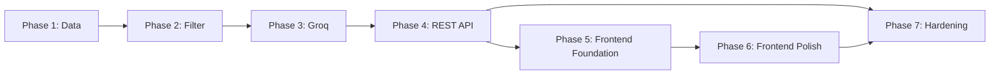

# Phase-Wise Implementation Plan

> AI-Powered Restaurant Recommendation System (Zomato Use Case)

Derived from [architecture.md](./architecture.md) and [context.md](./context.md).

---

## Overview

The implementation is split into two independent tracks that converge at the API boundary:

| Track | Phases | Outcome |
|-------|--------|---------|
| **Backend** | Phase 1 → Phase 2 → Phase 3 → Phase 4 | Python/FastAPI service exposing `/api/v1/*` endpoints |
| **Frontend** | Phase 5 → Phase 6 | React + Vite SPA consuming the FastAPI backend |

Phase 5 (Frontend Foundation) can begin once Phase 4 (API) is stable. Phase 6 (Frontend Polish) follows Phase 5.

---

## ═══════════════════════════════════════════
## BACKEND TRACK
## ═══════════════════════════════════════════

---

## Phase 1 — Data Layer

**Goal:** Load the Zomato dataset from Hugging Face, preprocess it into a canonical schema, cache it locally, and expose an in-memory query interface.

### 1.1 Project Scaffolding

| # | Task | Deliverable |
|---|------|-------------|
| 1 | Create directory structure per [architecture.md §7](./architecture.md) | `src/`, `src/models/`, `src/data/`, `src/services/`, `src/api/`, `src/ui/`, `tests/`, `data/` |
| 2 | Create `requirements.txt` with core deps | `datasets`, `pandas`, `groq`, `fastapi`, `uvicorn`, `pydantic-settings`, `python-dotenv`, `streamlit`, `pytest` |
| 3 | Create `.env.example` with all env vars from [§10.1](./architecture.md) | `GROQ_API_KEY`, `GROQ_MODEL`, `HF_DATASET_NAME`, etc. |
| 4 | Create `.gitignore` | Ignore `data/`, `.env`, `__pycache__/`, `.venv/` |

### 1.2 Configuration Module

| # | Task | Deliverable |
|---|------|-------------|
| 1 | Implement `src/config.py` using `pydantic-settings` | Typed settings: `GROQ_API_KEY`, `GROQ_MODEL`, `GROQ_FALLBACK_MODEL`, `GROQ_TEMPERATURE`, `HF_DATASET_NAME`, `BUDGET_THRESHOLDS`, `MAX_CANDIDATES_FOR_LLM`, `TOP_K_RECOMMENDATIONS`, `DATA_CACHE_PATH` |
| 2 | Define `BUDGET_THRESHOLDS` | `{"low": (0, 500), "medium": (501, 1500), "high": (1501, float("inf"))}` — tune after inspecting data distribution |

### 1.3 Data Models

| # | Task | Deliverable |
|---|------|-------------|
| 1 | Implement `src/models/restaurant.py` | `Restaurant` dataclass: `id`, `name`, `location`, `cuisines: list[str]`, `cost_for_two: int`, `rating: float`, `votes: int`, `rest_type: str`, `budget_tier: str` |
| 2 | Implement `src/models/preferences.py` | `UserPreferences` dataclass: `location`, `budget`, `cuisine`, `min_rating`, `additional` |
| 3 | Implement `src/models/recommendation.py` | `Recommendation` dataclass + `RecommendationResponse` dataclass with `summary`, `recommendations`, `metadata` |

### 1.4 Dataset Loader

| # | Task | Deliverable |
|---|------|-------------|
| 1 | Implement `src/data/loader.py` | `DatasetLoader` class: `load()` → downloads `ManikaSaini/zomato-restaurant-recommendation` via Hugging Face `datasets`; checks local `data/` cache first; saves parquet snapshot after first download |
| 2 | Add retry with backoff for download failures | Exponential backoff (3 retries); log errors clearly |

### 1.5 Data Preprocessor

| # | Task | Deliverable |
|---|------|-------------|
| 1 | Implement `src/data/preprocessor.py` | `DataPreprocessor` class that: (a) selects & renames columns to canonical schema, (b) parses cuisine strings into lists, (c) coerces rating/cost to numeric, drops invalid rows, (d) normalizes location strings (trim, title-case), (e) derives `budget_tier` from `cost_for_two` using `BUDGET_THRESHOLDS` |
| 2 | Log row counts before/after preprocessing | Helps identify data quality issues early |

### 1.6 Restaurant Repository

| # | Task | Deliverable |
|---|------|-------------|
| 1 | Implement `src/data/repository.py` | `RestaurantRepository` class: holds preprocessed data in-memory (pandas DataFrame); exposes `get_all() → list[Restaurant]`, `get_locations() → list[str]`, `get_cuisines() → list[str]`, `query(filters) → list[Restaurant]` |
| 2 | Add lazy initialization | Load dataset on first access, not at import time |

### 1.7 Verification

| # | Task | Deliverable |
|---|------|-------------|
| 1 | Write `tests/test_preprocessor.py` | Test cuisine parsing, numeric coercion, budget tier derivation, location normalization using a small fixture (10–20 rows) |
| 2 | Manual smoke test | Run loader + preprocessor + repository end-to-end; verify row counts and field types |

---

## Phase 2 — Filtering & Validation

**Goal:** Validate user preferences and apply deterministic hard filters to produce a bounded candidate set for Groq.

### 2.1 Preference Validator

| # | Task | Deliverable |
|---|------|-------------|
| 1 | Implement `src/services/validator.py` | `PreferenceValidator` class: (a) `location` must be non-empty and match at least one value in dataset (return closest matches if not), (b) `budget` must be one of `low/medium/high`, (c) `min_rating` must be float in `[0.0, 5.0]`, (d) `cuisine` optional fuzzy match against dataset vocabulary |
| 2 | Return structured validation result | `ValidationResult` with `is_valid`, `errors`, `suggestions` (e.g., "Did you mean 'Bangalore'?") |

### 2.2 Preference Normalizer

| # | Task | Deliverable |
|---|------|-------------|
| 1 | Implement normalizer logic | Lowercase cuisine, map city aliases (e.g., "Bengaluru" → "Bangalore"), trim free-text `additional` field |

### 2.3 Restaurant Filter

| # | Task | Deliverable |
|---|------|-------------|
| 1 | Implement `src/services/filter.py` | `RestaurantFilter` class: sequential filter pipeline — (1) location match (case-insensitive), (2) budget tier match, (3) min_rating filter, (4) cuisine filter (match if any restaurant cuisine includes the requested cuisine) |
| 2 | Sort filtered results | By `rating` descending, then `votes` descending |
| 3 | Implement `CandidateSelector` | Cap results at `MAX_CANDIDATES_FOR_LLM` (default 20); apply tie-breaking |

### 2.4 Constraint Relaxation

| # | Task | Deliverable |
|---|------|-------------|
| 1 | Implement relaxation fallback | If zero candidates: relax constraints in order **cuisine → budget → min_rating**; surface a warning to the user indicating which filters were relaxed |

### 2.5 Verification

| # | Task | Deliverable |
|---|------|-------------|
| 1 | Write `tests/test_filter.py` | Test each filter independently and in combination; test edge cases (empty results, no cuisine filter, zero-match location) |
| 2 | Test constraint relaxation | Verify that relaxation order is respected and warning is surfaced |

---

## Phase 3 — Groq Integration (LLM Layer)

**Goal:** Build the prompt, call Groq, parse structured JSON output, and merge with dataset records.

### 3.1 Prompt Builder

| # | Task | Deliverable |
|---|------|-------------|
| 1 | Implement `src/services/prompt_builder.py` | `PromptBuilder` class: (a) system prompt with role, output format (JSON), ranking criteria, (b) user preferences serialized, (c) candidate restaurants as compact JSON array with `id` field, (d) task instructions: rank top K, explain each pick, optionally summarize |
| 2 | Enforce Groq constraints in prompt | "Only recommend from the provided list — no fabrication"; include `additional` preferences as soft signals |
| 3 | Keep prompt token-efficient | Compact JSON for candidates; avoid redundant descriptions |

### 3.2 Groq Client (LLM Client)

| # | Task | Deliverable |
|---|------|-------------|
| 1 | Implement `src/services/llm_client.py` | `LLMClient` class: wraps `groq` SDK chat completions; configured via `config.py` (`GROQ_API_KEY`, `GROQ_MODEL`, `GROQ_TEMPERATURE`); uses `response_format={"type": "json_object"}` when model supports it |
| 2 | Implement retry logic | On invalid JSON response: retry once with temperature reduced to `0.1`; on 429 rate limit: exponential backoff (up to 3 retries) |
| 3 | Implement fallback to heuristic ranking | If Groq fails after retries: return top-K by rating with generic explanation ("Ranked by rating — AI explanation unavailable") |
| 4 | Log per-request metadata | Model ID, latency, token usage from `response.usage` |

### 3.3 Response Parser

| # | Task | Deliverable |
|---|------|-------------|
| 1 | Implement response parsing | Extract JSON from Groq output; validate schema: `{"summary": str, "recommendations": [{"id": str, "rank": int, "explanation": str}]}` |
| 2 | Handle malformed output | If JSON parse fails or schema invalid: trigger retry with lower temperature; if still fails, return empty recommendations list (heuristic fallback) |

### 3.4 Recommendation Enricher

| # | Task | Deliverable |
|---|------|-------------|
| 1 | Implement enrichment logic | Join Groq response (rank + explanation) with full `Restaurant` records from repository using `id` field; construct `Recommendation` objects with `name`, `cuisine`, `rating`, `estimated_cost`, `explanation` |
| 2 | Build `RecommendationResponse` | Include `summary`, `recommendations` list, and `metadata` (candidates_considered, filters_applied, model used) |

### 3.5 Recommendation Service (Orchestrator)

| # | Task | Deliverable |
|---|------|-------------|
| 1 | Implement `src/services/recommendation.py` | `RecommendationService` class: orchestrates the full pipeline — validate preferences → filter candidates → build prompt → call Groq → parse response → enrich → return `RecommendationResponse` |
| 2 | Wire all components together | Inject repository, filter, prompt builder, LLM client, parser, enricher as dependencies |

### 3.6 Verification

| # | Task | Deliverable |
|---|------|-------------|
| 1 | Write `tests/test_recommendation.py` | Integration test: mock `LLMClient` to return fixed JSON; verify enriched output has correct fields and ranks |
| 2 | Test prompt builder snapshot | Verify prompt contains all candidates and preference fields |
| 3 | Test response parser | Valid JSON, invalid JSON, missing fields, extra fields |
| 4 | End-to-end smoke test with real Groq API | (Requires `GROQ_API_KEY` in `.env`) Verify full pipeline returns ranked recommendations with explanations |

---

## Phase 4 — REST API Layer

**Goal:** Expose the recommendation pipeline as a production-ready FastAPI service with CORS enabled for the frontend.

### 4.1 FastAPI Application Setup

| # | Task | Deliverable |
|---|------|-------------|
| 1 | Create `src/api/schemas.py` | Pydantic request/response models: `RecommendRequest`, `RecommendResponse`, `HealthResponse`, `LocationsResponse`, `CuisinesResponse` |
| 2 | Create `src/api/routes.py` | Four endpoints: `POST /api/v1/recommend`, `GET /api/v1/health`, `GET /api/v1/locations`, `GET /api/v1/cuisines` |
| 3 | Create `src/main.py` | FastAPI app factory; lifespan event to preload dataset; mount routes; configure CORS middleware to allow frontend origin |

### 4.2 API Endpoints

| # | Task | Deliverable |
|---|------|-------------|
| 1 | `GET /api/v1/health` | Returns `{"status": "ok", "dataset_loaded": true/false}` |
| 2 | `GET /api/v1/locations` | Returns distinct locations from repository; sorted alphabetically |
| 3 | `GET /api/v1/cuisines` | Returns distinct cuisines from repository; sorted alphabetically |
| 4 | `POST /api/v1/recommend` | Accepts `RecommendRequest`, validates, calls `RecommendationService`, returns `RecommendResponse`; handles errors with appropriate HTTP status codes (400 for validation, 502 for Groq failure with fallback) |

### 4.3 CORS & Developer Experience

| # | Task | Deliverable |
|---|------|-------------|
| 1 | Add CORS middleware | Allow `http://localhost:5173` (Vite dev server) and production origin; allow all standard headers and methods |
| 2 | Add OpenAPI documentation | Auto-generated at `/docs`; include example request/response in schema descriptions |
| 3 | Add request validation error handler | Return `{"error": ..., "details": [...]}` on `RequestValidationError` |

### 4.4 CLI Interface (Dev Utility)

| # | Task | Deliverable |
|---|------|-------------|
| 1 | Implement `src/ui/cli.py` | Interactive CLI for local testing: prompt for location, budget, cuisine, min_rating, additional preferences; call `RecommendationService`; display formatted results in terminal |

### 4.5 Verification

| # | Task | Deliverable |
|---|------|-------------|
| 1 | Test API with `curl` / httpie | Hit all four endpoints; verify response shapes match schema |
| 2 | Verify CORS headers | Preflight `OPTIONS /api/v1/recommend` returns `Access-Control-Allow-Origin` |
| 3 | Test CLI interactively | Enter preferences and verify output |

---

## ═══════════════════════════════════════════
## FRONTEND TRACK
## ═══════════════════════════════════════════

> **Technology choice:** React 18 + Vite + TypeScript + TailwindCSS + shadcn/ui
>
> Rationale: React+Vite gives a fast dev experience and production-ready bundle. TypeScript ensures type-safety when consuming the FastAPI response schema. TailwindCSS + shadcn/ui provides a polished, accessible component library without custom CSS overhead.
>
> **Frontend lives in:** `frontend/` at the project root (separate from `src/`).

---

## Phase 5 — Frontend Foundation

**Goal:** Scaffold the React app, wire up the API client, and build the core preference form and results display.

### 5.1 Project Scaffold

| # | Task | Deliverable |
|---|------|-------------|
| 1 | Initialize Vite + React + TypeScript project | `frontend/` directory; `npm create vite@latest frontend -- --template react-ts` |
| 2 | Install dependencies | `tailwindcss`, `@tailwindcss/vite`, `shadcn-ui` CLI, `axios` or `fetch` wrapper (`ky`), `react-hook-form`, `zod`, `lucide-react` |
| 3 | Configure Tailwind | `tailwind.config.ts` with content paths; import in `index.css` |
| 4 | Initialize shadcn/ui | `npx shadcn-ui@latest init`; add components: `Button`, `Card`, `Badge`, `Slider`, `Select`, `Input`, `Textarea`, `Skeleton`, `Alert`, `Separator`, `Tooltip` |
| 5 | Configure Vite proxy | `vite.config.ts` proxy `/api` → `http://localhost:8000` to avoid CORS in dev |
| 6 | Set up path aliases | `@/` alias for `src/` in `tsconfig.json` and `vite.config.ts` |

### 5.2 API Client & Types

| # | Task | Deliverable |
|---|------|-------------|
| 1 | Define TypeScript types | `frontend/src/types/api.ts`: `RecommendRequest`, `Recommendation`, `RecommendationResponse`, `HealthResponse` mirroring FastAPI schemas |
| 2 | Implement API client | `frontend/src/lib/api.ts`: typed functions `getLocations()`, `getCuisines()`, `getHealth()`, `postRecommend(req)` using `fetch` with base URL from env var `VITE_API_BASE_URL` |
| 3 | Add error handling | Parse 4xx/5xx responses and surface structured `ApiError` type |

### 5.3 Application Layout & Routing

| # | Task | Deliverable |
|---|------|-------------|
| 1 | Create app shell | `frontend/src/App.tsx`: full-page layout with sticky header (logo + app name), main content area, footer |
| 2 | Design layout | Two-column layout on desktop (sidebar: filters, main: results); single-column stack on mobile |
| 3 | Add theme system | Light/dark mode toggle using Tailwind `dark:` variants + `localStorage` persistence |
| 4 | Add global loading state | React Context or Zustand atom for API loading indicator |

### 5.4 Preference Form Component

| # | Task | Deliverable |
|---|------|-------------|
| 1 | Implement `PreferenceForm` | `frontend/src/components/PreferenceForm.tsx`; managed by `react-hook-form` + `zod` validation schema |
| 2 | Location field | Searchable `<Select>` populated from `GET /api/v1/locations`; shows loading skeleton while fetching |
| 3 | Budget field | Segmented control / Radio group: `Low` / `Medium` / `High` with INR range hints (≤₹500 / ₹501–1,500 / ₹1,500+) |
| 4 | Cuisine field | Searchable `<Select>` populated from `GET /api/v1/cuisines`; "Any cuisine" default option |
| 5 | Min Rating field | `<Slider>` from 0.0 → 5.0 step 0.5; display current value with star icon |
| 6 | Additional Preferences | `<Textarea>` with character counter; placeholder examples ("family-friendly, outdoor seating") |
| 7 | Form validation | Inline error messages via `zod`: location required, budget required, rating range 0–5 |
| 8 | Submit button | Disabled while loading; shows spinner icon; label changes to "Finding restaurants…" |

### 5.5 Results Display Components

| # | Task | Deliverable |
|---|------|-------------|
| 1 | Implement `SummaryBanner` | `frontend/src/components/SummaryBanner.tsx`; gradient card at top showing Groq-generated summary; only renders when `summary` is non-null |
| 2 | Implement `FilterBadges` | Row of dismissible badges showing applied filters (location, budget, cuisine, rating); shows relaxation warning if filters were loosened |
| 3 | Implement `RecommendationCard` | `frontend/src/components/RecommendationCard.tsx`; displays: rank badge (numbered circle), restaurant name (bold headline), cuisine tags (colored badges), star rating with numeric value, cost for two (₹ formatted), AI explanation (collapsible on mobile), rest type chip |
| 4 | Implement `ResultsGrid` | `frontend/src/components/ResultsGrid.tsx`; responsive grid (1 col mobile, 2 col tablet, 3 col desktop); animates cards in with staggered fade-up on mount |
| 5 | Implement `EmptyState` | Illustrated empty state with message + suggestions ("Try broadening your filters") |
| 6 | Implement `LoadingSkeleton` | Skeleton cards matching `RecommendationCard` layout; shown during API call |

### 5.6 Home Page Assembly

| # | Task | Deliverable |
|---|------|-------------|
| 1 | Compose `HomePage` | `frontend/src/pages/HomePage.tsx`; orchestrates form submission → loading state → results render |
| 2 | Handle all states | idle (hero prompt), loading (skeletons), success (results), error (Alert with retry button), empty (EmptyState) |
| 3 | Scroll behavior | Auto-scroll to results section after successful response |

### 5.7 Verification

| # | Task | Deliverable |
|---|------|-------------|
| 1 | Run `npm run dev` | App starts on `http://localhost:5173`; form fields load locations and cuisines from API |
| 2 | Submit preferences | Spinner shows → results render with cards → summary banner visible |
| 3 | Test empty state | Use filters that return no results; EmptyState component renders |
| 4 | Mobile responsiveness | Test at 375px, 768px, 1280px breakpoints; layout adapts correctly |

---

## Phase 6 — Frontend Polish & Production Quality

**Goal:** Elevate the UI to production quality with animations, accessibility, error boundaries, and build optimization.

### 6.1 Visual Design System

| # | Task | Deliverable |
|---|------|-------------|
| 1 | Define color palette | Zomato-inspired: `red-600` primary, `orange-500` accent, neutral grays; update `tailwind.config.ts` with custom brand colors |
| 2 | Typography scale | `Inter` font via Google Fonts; `text-display` for headings, `text-body` for body text |
| 3 | Design hero section | Full-width banner with background pattern/gradient, headline "Find Your Perfect Restaurant", subheadline, search CTA |
| 4 | Card hover states | `group-hover` scale + shadow elevation; smooth 200ms transition |
| 5 | Rank badge design | Numbered circles: rank 1 = gold, rank 2 = silver, rank 3 = bronze, rest = neutral |

### 6.2 Animations & Micro-interactions

| # | Task | Deliverable |
|---|------|-------------|
| 1 | Install Framer Motion | `npm install framer-motion` |
| 2 | Animate results entry | Cards stagger-fade-up on results render (`AnimatePresence` + `motion.div` with `initial/animate/exit`) |
| 3 | Animate form submission | Button loading pulse; form panel slides/fades out when results load |
| 4 | Animate empty state | Subtle bounce animation on empty state illustration |
| 5 | Page transitions | Fade transition between idle/loading/results states |

### 6.3 Accessibility (a11y)

| # | Task | Deliverable |
|---|------|-------------|
| 1 | Semantic HTML | Use `<main>`, `<aside>`, `<section>`, `<article>` correctly; heading hierarchy h1→h2→h3 |
| 2 | ARIA labels | All form controls have `aria-label` or associated `<label>`; loading states use `aria-busy` |
| 3 | Keyboard navigation | Full tab-order through form and results; focus trap in modals if any |
| 4 | Color contrast | All text passes WCAG AA (4.5:1 minimum) in both light and dark modes |
| 5 | Screen reader support | `aria-live="polite"` region updates when results load |

### 6.4 Error Handling & Resilience

| # | Task | Deliverable |
|---|------|-------------|
| 1 | Global error boundary | `frontend/src/components/ErrorBoundary.tsx`; catches render errors; shows friendly fallback UI |
| 2 | API error states | Distinct UI for: network error, 400 validation error (show field hints), 502 Groq failure (show "AI unavailable, showing top-rated results"), 503 service unavailable |
| 3 | Retry mechanism | "Try again" button on error states re-fires the last request |
| 4 | Offline detection | Banner when `navigator.onLine === false`; disables form submit |

### 6.5 Performance Optimization

| # | Task | Deliverable |
|---|------|-------------|
| 1 | Code splitting | Lazy-load heavy components (`React.lazy` + `Suspense`) |
| 2 | Cache API responses | Cache `locations` and `cuisines` responses in React Query or `useMemo` (they don't change between sessions) |
| 3 | Debounce form interactions | Debounce slider input by 300ms to avoid excessive re-renders |
| 4 | Image optimization | Use `loading="lazy"` on any decorative images; prefer SVG icons (lucide-react) |
| 5 | Bundle analysis | Run `npm run build`; check bundle size; split vendor chunks |

### 6.6 Developer Experience

| # | Task | Deliverable |
|---|------|-------------|
| 1 | Add ESLint + Prettier | `eslint-config-react` + `prettier`; enforce consistent formatting |
| 2 | Add `.env.example` for frontend | `VITE_API_BASE_URL=http://localhost:8000`; document in inline comments |
| 3 | Add npm scripts | `dev`, `build`, `preview`, `lint`, `type-check` in `frontend/package.json` |
| 4 | Concurrent dev startup | Root-level `package.json` script `dev:all` runs FastAPI + Vite in parallel using `concurrently` |

### 6.7 Final Verification

| # | Task | Deliverable |
|---|------|-------------|
| 1 | Full end-to-end test | Start backend + frontend; submit preferences; verify ranked cards with AI explanations render |
| 2 | Dark mode verification | Toggle dark mode; verify all components look correct |
| 3 | Mobile layout test | Test on 375px (iPhone SE) and 390px (iPhone 14) viewport widths |
| 4 | Lighthouse audit | Run Lighthouse in Chrome; target: Performance ≥ 90, Accessibility ≥ 95, Best Practices ≥ 95 |
| 5 | Cross-browser test | Verify on Chrome, Firefox, and Safari/Edge |

---

## Phase 7 — Hardening & Testing (Cross-Track)

**Goal:** Add robust error handling, comprehensive tests, logging, and security hardening across both tracks.

### 7.1 Backend Error Handling

| # | Task | Deliverable |
|---|------|-------------|
| 1 | Dataset download failure | Retry with backoff (already in loader); surface HTTP 503 from health endpoint |
| 2 | No restaurants match filters | Constraint relaxation (already in filter); include `relaxed_filters` field in API response |
| 3 | Groq returns invalid JSON | Retry with lower temperature (already in LLM client); fallback to heuristic ranking |
| 4 | Groq timeout / 429 rate limit | Exponential backoff + heuristic fallback; return `"ai_available": false` in metadata |
| 5 | Unknown location | Return `suggestions` array in 400 response body |

### 7.2 Logging & Observability

| # | Task | Deliverable |
|---|------|-------------|
| 1 | Add structured logging | Log filter counts (input → candidate size), Groq latency, token usage, errors |
| 2 | Sanitize logs | Never log API keys or full prompts; redact sensitive fields |
| 3 | Optional request tracing | Add trace ID per recommendation request for debugging |

### 7.3 Comprehensive Backend Tests

| # | Task | Deliverable |
|---|------|-------------|
| 1 | Unit: `RestaurantFilter` | Test all filter combinations, edge cases, constraint relaxation |
| 2 | Unit: `DataPreprocessor` | Test cuisine parsing, numeric coercion, budget tier derivation, null handling |
| 3 | Unit: `ResponseParser` | Valid/invalid Groq JSON, schema validation, malformed output |
| 4 | Unit: `PromptBuilder` | Snapshot test: prompt contains all candidates and preference fields |
| 5 | Unit: `PreferenceValidator` | Valid/invalid inputs, fuzzy matching, suggestion generation |
| 6 | Integration: `RecommendationService` | Mock Groq client; verify end-to-end pipeline with enriched output |
| 7 | Use frozen dataset fixture | 10–20 rows for deterministic tests; mock Groq in all tests |

### 7.4 Security

| # | Task | Deliverable |
|---|------|-------------|
| 1 | API key management | `GROQ_API_KEY` only in `.env` (never committed); `.gitignore` enforced |
| 2 | Input sanitization | All user inputs validated and sanitized before processing |
| 3 | Rate limiting (if deploying publicly) | Add FastAPI rate-limit middleware |
| 4 | Frontend env vars | Never expose `GROQ_API_KEY` in frontend; only `VITE_API_BASE_URL` is needed |

### 7.5 Final Verification

| # | Task | Deliverable |
|---|------|-------------|
| 1 | Full test suite passes | `pytest` with all unit + integration tests green |
| 2 | End-to-end test with real Groq API | Submit preferences via frontend; verify ranked recommendations with explanations |
| 3 | Error scenario testing | Simulate: no results, Groq failure, invalid inputs, missing API key — all handled gracefully in UI |
| 4 | Performance check | Dataset loads in <5s; Groq call returns in <10s; total request <15s; Lighthouse ≥ 90 |

---

## Cross-Phase Dependencies

- **Phases 1–4** form the backend track and must be completed in order.
- **Phase 5** can start as soon as Phase 4 API contracts are defined (even before full implementation, using mock responses).
- **Phase 6** depends on a stable Phase 5.
- **Phase 7** runs across both tracks after Phase 6.

---

## Estimated Effort

| Phase | Scope | Estimated Time |
|-------|-------|----------------|
| Phase 1 — Data | Scaffolding, models, loader, preprocessor, repository | 4–6 hours |
| Phase 2 — Filter | Validation, normalization, filtering, constraint relaxation | 3–4 hours |
| Phase 3 — Groq | Prompt builder, LLM client, parser, enricher, orchestrator | 5–7 hours |
| Phase 4 — REST API | FastAPI routes, schemas, CORS, CLI | 3–4 hours |
| Phase 5 — Frontend Foundation | Scaffold, API client, form, results components | 6–8 hours |
| Phase 6 — Frontend Polish | Animations, a11y, error handling, performance | 5–7 hours |
| Phase 7 — Hardening | Error handling, logging, tests, security | 4–5 hours |
| **Total** | | **30–41 hours** |

---

## Risk Mitigation

| Risk | Mitigation |
|------|------------|
| Dataset schema differs from expected | Inspect dataset columns in Phase 1 before preprocessing; adjust mapping |
| Groq rate limits during development | Use `llama-3.1-8b-instant` (fallback model) for dev; cache Groq responses in tests |
| Groq JSON output inconsistent | Enforce JSON mode + retry with lower temperature + heuristic fallback |
| Budget thresholds don't fit data distribution | Tune thresholds after inspecting actual `cost_for_two` distribution in Phase 1 |
| Location names inconsistent in dataset | Build alias map during preprocessing; fuzzy match in validator |
| CORS issues in development | Use Vite proxy (`/api` → `localhost:8000`); configure FastAPI CORS for production origin |
| React bundle size | Code-split heavy components; monitor with `rollup-plugin-visualizer` |
| TypeScript schema drift from backend | Keep `frontend/src/types/api.ts` in sync with FastAPI Pydantic schemas; consider code-gen from OpenAPI spec |
# Phase-Wise Implementation Plan

> AI-Powered Restaurant Recommendation System (Zomato Use Case)

Derived from [architecture.md](./architecture.md) and [context.md](./context.md).

---

## Phase 1 — Data Layer

**Goal:** Load the Zomato dataset from Hugging Face, preprocess it into a canonical schema, cache it locally, and expose an in-memory query interface.

### 1.1 Project Scaffolding

| # | Task | Deliverable |
|---|------|-------------|
| 1 | Create directory structure per [architecture.md §7](./architecture.md) | `src/`, `src/models/`, `src/data/`, `src/services/`, `src/api/`, `src/ui/`, `tests/`, `data/` |
| 2 | Create `requirements.txt` with core deps | `datasets`, `pandas`, `groq`, `fastapi`, `uvicorn`, `pydantic-settings`, `python-dotenv`, `streamlit`, `pytest` |
| 3 | Create `.env.example` with all env vars from [§10.1](./architecture.md) | `GROQ_API_KEY`, `GROQ_MODEL`, `HF_DATASET_NAME`, etc. |
| 4 | Create `.gitignore` | Ignore `data/`, `.env`, `__pycache__/`, `.venv/` |

### 1.2 Configuration Module

| # | Task | Deliverable |
|---|------|-------------|
| 1 | Implement `src/config.py` using `pydantic-settings` | Typed settings: `GROQ_API_KEY`, `GROQ_MODEL`, `GROQ_FALLBACK_MODEL`, `GROQ_TEMPERATURE`, `HF_DATASET_NAME`, `BUDGET_THRESHOLDS`, `MAX_CANDIDATES_FOR_LLM`, `TOP_K_RECOMMENDATIONS`, `DATA_CACHE_PATH` |
| 2 | Define `BUDGET_THRESHOLDS` | `{"low": (0, 500), "medium": (501, 1500), "high": (1501, float("inf"))}` — tune after inspecting data distribution |

### 1.3 Data Models

| # | Task | Deliverable |
|---|------|-------------|
| 1 | Implement `src/models/restaurant.py` | `Restaurant` dataclass: `id`, `name`, `location`, `cuisines: list[str]`, `cost_for_two: int`, `rating: float`, `votes: int`, `rest_type: str`, `budget_tier: str` |
| 2 | Implement `src/models/preferences.py` | `UserPreferences` dataclass: `location`, `budget`, `cuisine`, `min_rating`, `additional` |
| 3 | Implement `src/models/recommendation.py` | `Recommendation` dataclass + `RecommendationResponse` dataclass with `summary`, `recommendations`, `metadata` |

### 1.4 Dataset Loader

| # | Task | Deliverable |
|---|------|-------------|
| 1 | Implement `src/data/loader.py` | `DatasetLoader` class: `load()` → downloads `ManikaSaini/zomato-restaurant-recommendation` via Hugging Face `datasets`; checks local `data/` cache first; saves parquet snapshot after first download |
| 2 | Add retry with backoff for download failures | Exponential backoff (3 retries); log errors clearly |

### 1.5 Data Preprocessor

| # | Task | Deliverable |
|---|------|-------------|
| 1 | Implement `src/data/preprocessor.py` | `DataPreprocessor` class that: (a) selects & renames columns to canonical schema, (b) parses cuisine strings into lists, (c) coerces rating/cost to numeric, drops invalid rows, (d) normalizes location strings (trim, title-case), (e) derives `budget_tier` from `cost_for_two` using `BUDGET_THRESHOLDS` |
| 2 | Log row counts before/after preprocessing | Helps identify data quality issues early |

### 1.6 Restaurant Repository

| # | Task | Deliverable |
|---|------|-------------|
| 1 | Implement `src/data/repository.py` | `RestaurantRepository` class: holds preprocessed data in-memory (pandas DataFrame); exposes `get_all() → list[Restaurant]`, `get_locations() → list[str]`, `get_cuisines() → list[str]`, `query(filters) → list[Restaurant]` |
| 2 | Add lazy initialization | Load dataset on first access, not at import time |

### 1.7 Verification

| # | Task | Deliverable |
|---|------|-------------|
| 1 | Write `tests/test_preprocessor.py` | Test cuisine parsing, numeric coercion, budget tier derivation, location normalization using a small fixture (10–20 rows) |
| 2 | Manual smoke test | Run loader + preprocessor + repository end-to-end; verify row counts and field types |

---

## Phase 2 — Filtering & Validation

**Goal:** Validate user preferences and apply deterministic hard filters to produce a bounded candidate set for Groq.

### 2.1 Preference Validator

| # | Task | Deliverable |
|---|------|-------------|
| 1 | Implement `src/services/validator.py` | `PreferenceValidator` class: (a) `location` must be non-empty and match at least one value in dataset (return closest matches if not), (b) `budget` must be one of `low/medium/high`, (c) `min_rating` must be float in `[0.0, 5.0]`, (d) `cuisine` optional fuzzy match against dataset vocabulary |
| 2 | Return structured validation result | `ValidationResult` with `is_valid`, `errors`, `suggestions` (e.g., "Did you mean 'Bangalore'?") |

### 2.2 Preference Normalizer

| # | Task | Deliverable |
|---|------|-------------|
| 1 | Implement normalizer logic | Lowercase cuisine, map city aliases (e.g., "Bengaluru" → "Bangalore"), trim free-text `additional` field |

### 2.3 Restaurant Filter

| # | Task | Deliverable |
|---|------|-------------|
| 1 | Implement `src/services/filter.py` | `RestaurantFilter` class: sequential filter pipeline — (1) location match (case-insensitive), (2) budget tier match, (3) min_rating filter, (4) cuisine filter (match if any restaurant cuisine includes the requested cuisine) |
| 2 | Sort filtered results | By `rating` descending, then `votes` descending |
| 3 | Implement `CandidateSelector` | Cap results at `MAX_CANDIDATES_FOR_LLM` (default 20); apply tie-breaking |

### 2.4 Constraint Relaxation

| # | Task | Deliverable |
|---|------|-------------|
| 1 | Implement relaxation fallback | If zero candidates: relax constraints in order **cuisine → budget → min_rating**; surface a warning to the user indicating which filters were relaxed |

### 2.5 Verification

| # | Task | Deliverable |
|---|------|-------------|
| 1 | Write `tests/test_filter.py` | Test each filter independently and in combination; test edge cases (empty results, no cuisine filter, zero-match location) |
| 2 | Test constraint relaxation | Verify that relaxation order is respected and warning is surfaced |

---

## Phase 3 — Groq Integration (LLM Layer)

**Goal:** Build the prompt, call Groq, parse structured JSON output, and merge with dataset records.

### 3.1 Prompt Builder

| # | Task | Deliverable |
|---|------|-------------|
| 1 | Implement `src/services/prompt_builder.py` | `PromptBuilder` class: (a) system prompt with role, output format (JSON), ranking criteria, (b) user preferences serialized, (c) candidate restaurants as compact JSON array with `id` field, (d) task instructions: rank top K, explain each pick, optionally summarize |
| 2 | Enforce Groq constraints in prompt | "Only recommend from the provided list — no fabrication"; include `additional` preferences as soft signals |
| 3 | Keep prompt token-efficient | Compact JSON for candidates; avoid redundant descriptions |

### 3.2 Groq Client (LLM Client)

| # | Task | Deliverable |
|---|------|-------------|
| 1 | Implement `src/services/llm_client.py` | `LLMClient` class: wraps `groq` SDK chat completions; configured via `config.py` (`GROQ_API_KEY`, `GROQ_MODEL`, `GROQ_TEMPERATURE`); uses `response_format={"type": "json_object"}` when model supports it |
| 2 | Implement retry logic | On invalid JSON response: retry once with temperature reduced to `0.1`; on 429 rate limit: exponential backoff (up to 3 retries) |
| 3 | Implement fallback to heuristic ranking | If Groq fails after retries: return top-K by rating with generic explanation ("Ranked by rating — AI explanation unavailable") |
| 4 | Log per-request metadata | Model ID, latency, token usage from `response.usage` |

### 3.3 Response Parser

| # | Task | Deliverable |
|---|------|-------------|
| 1 | Implement response parsing | Extract JSON from Groq output; validate schema: `{"summary": str, "recommendations": [{"id": str, "rank": int, "explanation": str}]}` |
| 2 | Handle malformed output | If JSON parse fails or schema invalid: trigger retry with lower temperature; if still fails, return empty recommendations list (heuristic fallback) |

### 3.4 Recommendation Enricher

| # | Task | Deliverable |
|---|------|-------------|
| 1 | Implement enrichment logic | Join Groq response (rank + explanation) with full `Restaurant` records from repository using `id` field; construct `Recommendation` objects with `name`, `cuisine`, `rating`, `estimated_cost`, `explanation` |
| 2 | Build `RecommendationResponse` | Include `summary`, `recommendations` list, and `metadata` (candidates_considered, filters_applied, model used) |

### 3.5 Recommendation Service (Orchestrator)

| # | Task | Deliverable |
|---|------|-------------|
| 1 | Implement `src/services/recommendation.py` | `RecommendationService` class: orchestrates the full pipeline — validate preferences → filter candidates → build prompt → call Groq → parse response → enrich → return `RecommendationResponse` |
| 2 | Wire all components together | Inject repository, filter, prompt builder, LLM client, parser, enricher as dependencies |

### 3.6 Verification

| # | Task | Deliverable |
|---|------|-------------|
| 1 | Write `tests/test_recommendation.py` | Integration test: mock `LLMClient` to return fixed JSON; verify enriched output has correct fields and ranks |
| 2 | Test prompt builder snapshot | Verify prompt contains all candidates and preference fields |
| 3 | Test response parser | Valid JSON, invalid JSON, missing fields, extra fields |
| 4 | End-to-end smoke test with real Groq API | (Requires `GROQ_API_KEY` in `.env`) Verify full pipeline returns ranked recommendations with explanations |

---

## Phase 4 — Presentation Layer (API + UI)

**Goal:** Expose the recommendation pipeline via a REST API and provide an interactive UI.

### 4.1 FastAPI Application Setup

| # | Task | Deliverable |
|---|------|-------------|
| 1 | Create `src/api/schemas.py` | Pydantic request/response models matching [§9 API Design](./architecture.md): `RecommendRequest`, `RecommendResponse`, `HealthResponse`, `LocationsResponse`, `CuisinesResponse` |
| 2 | Create `src/api/routes.py` | Four endpoints: `POST /api/v1/recommend`, `GET /api/v1/health`, `GET /api/v1/locations`, `GET /api/v1/cuisines` |
| 3 | Create `src/main.py` | FastAPI app factory; lifespan event to preload dataset; mount routes |

### 4.2 API Endpoints

| # | Task | Deliverable |
|---|------|-------------|
| 1 | `GET /api/v1/health` | Returns `{"status": "ok", "dataset_loaded": true/false}` |
| 2 | `GET /api/v1/locations` | Returns distinct locations from repository; sorted alphabetically |
| 3 | `GET /api/v1/cuisines` | Returns distinct cuisines from repository; sorted alphabetically |
| 4 | `POST /api/v1/recommend` | Accepts `RecommendRequest`, validates, calls `RecommendationService`, returns `RecommendResponse`; handles errors with appropriate HTTP status codes (400 for validation, 502 for Groq failure with fallback) |

### 4.3 CLI Interface

| # | Task | Deliverable |
|---|------|-------------|
| 1 | Implement `src/ui/cli.py` | Interactive CLI: prompt for location, budget, cuisine, min_rating, additional preferences; call `RecommendationService`; display formatted results in terminal |
| 2 | Format output as a table | Rank, name, cuisine, rating, cost, explanation (truncated); show summary banner if available |

### 4.4 Streamlit Web UI

| # | Task | Deliverable |
|---|------|-------------|
| 1 | Implement `src/ui/streamlit_app.py` | Sidebar: location dropdown, budget radio buttons, cuisine dropdown, min_rating slider, additional text input; main area: results cards |
| 2 | Display recommendation cards | Each card shows: rank badge, name, cuisine, rating, cost, AI explanation; show summary banner at top |
| 3 | Show applied filters above results | Display current filter state; show warning if constraints were relaxed |
| 4 | Handle empty state | "No results" message with suggestions to broaden filters |
| 5 | Show loading spinner | While dataset loads or Groq responds |

### 4.5 Verification

| # | Task | Deliverable |
|---|------|-------------|
| 1 | Test API with `curl` / httpie | Hit all four endpoints; verify response shapes match schema |
| 2 | Test CLI interactively | Enter preferences and verify output |
| 3 | Test Streamlit app in browser | Submit preferences, verify cards render correctly |

---

## Phase 5 — Hardening & Testing

**Goal:** Add robust error handling, comprehensive tests, logging, and documentation.

### 5.1 Error Handling

| # | Task | Deliverable |
|---|------|-------------|
| 1 | Dataset download failure | Retry with backoff (already in loader); show clear error in UI with retry option |
| 2 | No restaurants match filters | Constraint relaxation (already in filter); show user-friendly message with filter suggestions |
| 3 | Groq returns invalid JSON | Retry with lower temperature (already in LLM client); fallback to heuristic ranking |
| 4 | Groq timeout / 429 rate limit | Exponential backoff + heuristic fallback (already in LLM client) |
| 5 | Unknown location | Return closest matches from dataset (already in validator) |

### 5.2 Logging & Observability

| # | Task | Deliverable |
|---|------|-------------|
| 1 | Add structured logging throughout | Log filter counts (input → candidate size), Groq latency, token usage, errors |
| 2 | Sanitize logs | Never log API keys or full prompts; redact sensitive fields |
| 3 | Optional request tracing | Add trace ID per recommendation request for debugging |

### 5.3 Comprehensive Tests

| # | Task | Deliverable |
|---|------|-------------|
| 1 | Unit: `RestaurantFilter` | Test all filter combinations, edge cases, constraint relaxation |
| 2 | Unit: `DataPreprocessor` | Test cuisine parsing, numeric coercion, budget tier derivation, null handling |
| 3 | Unit: `ResponseParser` | Valid/invalid Groq JSON, schema validation, malformed output |
| 4 | Unit: `PromptBuilder` | Snapshot test: prompt contains all candidates and preference fields |
| 5 | Unit: `PreferenceValidator` | Valid/invalid inputs, fuzzy matching, suggestion generation |
| 6 | Integration: `RecommendationService` | Mock Groq client; verify end-to-end pipeline with enriched output |
| 7 | Use frozen dataset fixture | 10–20 rows for deterministic tests; mock Groq in all tests |

### 5.4 Security

| # | Task | Deliverable |
|---|------|-------------|
| 1 | API key management | `GROQ_API_KEY` only in `.env` (never committed); `.gitignore` enforced |
| 2 | Input sanitization | All user inputs validated and sanitized before processing |
| 3 | Rate limiting (if deploying publicly) | Add FastAPI rate-limit middleware |

### 5.5 Final Verification

| # | Task | Deliverable |
|---|------|-------------|
| 1 | Full test suite passes | `pytest` with all unit + integration tests green |
| 2 | End-to-end test with real Groq API | Submit preferences via UI and API; verify ranked recommendations with explanations |
| 3 | Error scenario testing | Simulate: no results, Groq failure, invalid inputs, missing API key — all handled gracefully |
| 4 | Performance check | Verify dataset loads in <5s; Groq call returns in <10s; total request <15s |

---

## Cross-Phase Dependencies

- **Phase 1** is self-contained and must complete first.
- **Phase 2** depends on `RestaurantRepository` and `Restaurant` model from Phase 1.
- **Phase 3** depends on filtered candidates from Phase 2 and `UserPreferences` model from Phase 1.
- **Phase 4** depends on `RecommendationService` from Phase 3 and repository from Phase 1.
- **Phase 5** runs across all layers but is primarily focused after Phase 4.

---

## Estimated Effort

| Phase | Scope | Estimated Time |
|-------|-------|----------------|
| Phase 1 — Data | Scaffolding, models, loader, preprocessor, repository | 4–6 hours |
| Phase 2 — Filter | Validation, normalization, filtering, constraint relaxation | 3–4 hours |
| Phase 3 — Groq | Prompt builder, LLM client, parser, enricher, orchestrator | 5–7 hours |
| Phase 4 — UI | FastAPI routes, CLI, Streamlit app | 4–6 hours |
| Phase 5 — Hardening | Error handling, logging, comprehensive tests | 4–5 hours |
| **Total** | | **20–28 hours** |

---

## Risk Mitigation

| Risk | Mitigation |
|------|------------|
| Dataset schema differs from expected | Inspect dataset columns in Phase 1 before preprocessing; adjust mapping |
| Groq rate limits during development | Use `llama-3.1-8b-instant` (fallback model) for dev; cache Groq responses in tests |
| Groq JSON output inconsistent | Enforce JSON mode + retry with lower temperature + heuristic fallback |
| Budget thresholds don't fit data distribution | Tune thresholds after inspecting actual `cost_for_two` distribution in Phase 1 |
| Location names inconsistent in dataset | Build alias map during preprocessing; fuzzy match in validator |
